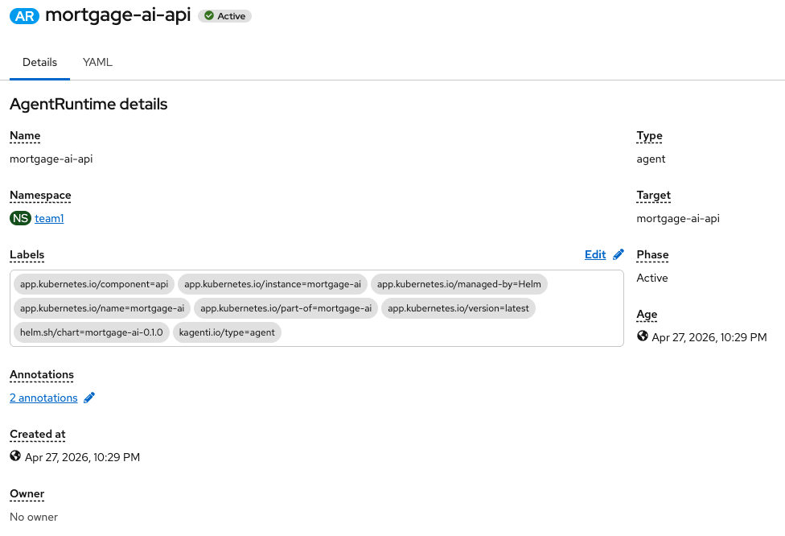
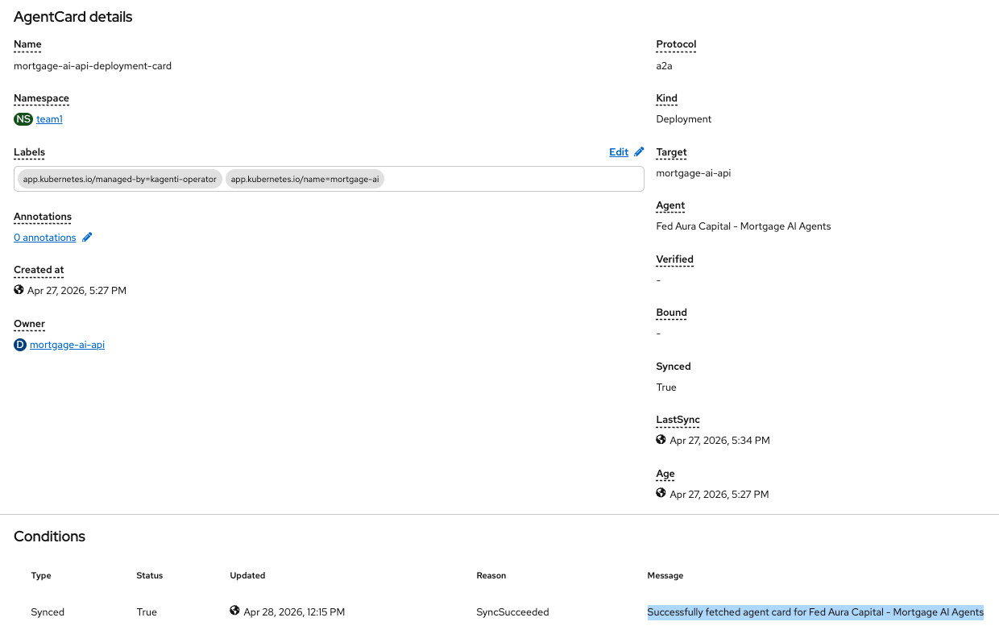
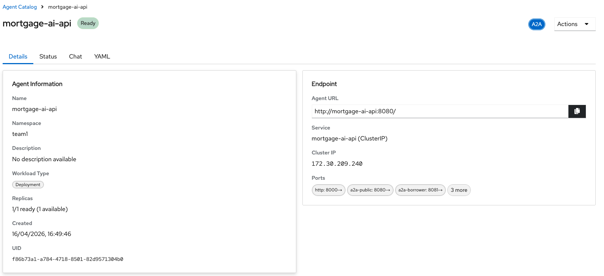
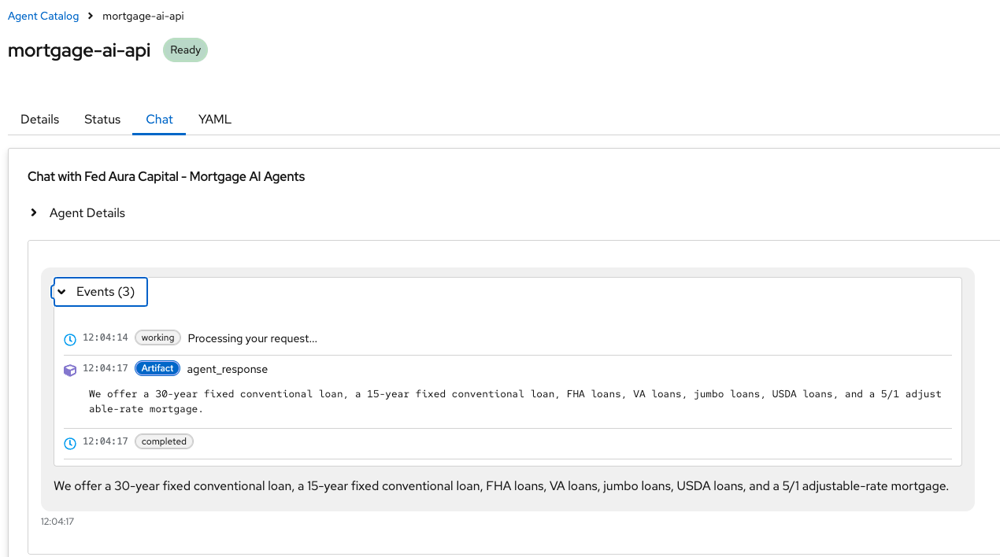
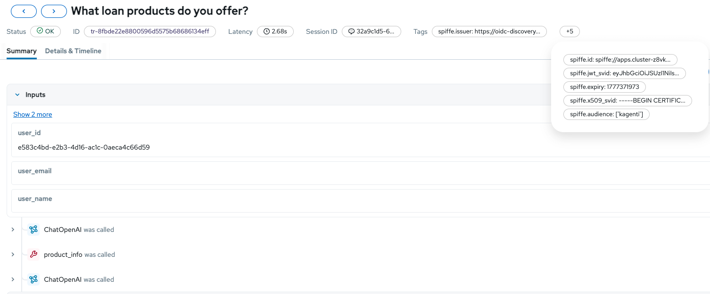

<!-- This project was developed with assistance from AI tools. -->
# Kagenti A2A Integration

This document describes how the mortgage AI agents are exposed via the [A2A (Agent-to-Agent)](https://google.github.io/A2A/) protocol and managed by [Kagenti](https://github.com/kagenti/kagenti) on OpenShift/Kubernetes.

## Overview

By default, the 5 LangGraph agents are only accessible through the FastAPI WebSocket endpoints (browser UI). With Kagenti enabled, every agent is also exposed as an A2A-compatible HTTP service that other agents, orchestrators, or tools can discover and invoke programmatically.

```
User -> Browser -> WebSocket -> LangGraph Agent
Other Agent -> A2A (HTTP) -> LangGraph Agent
Kagenti UI -> A2A (HTTP) -> LangGraph Agent
Any A2A client -> A2A (HTTP) -> LangGraph Agent
```

The integration is feature-gated by `KAGENTI_ENABLED=true`. When disabled (default), no A2A servers start, no ports are opened, and no Kagenti labels are added. Zero impact on existing functionality.

## A2A Protocol

A2A is an open protocol that standardizes how AI agents find and talk to each other. Three concepts matter:

**Agent Card** -- a JSON file at `/.well-known/agent-card.json` describing who the agent is, what skills it has, and how to reach it. Any system that knows the agent's URL can fetch this card and immediately know what the agent does.

**JSON-RPC Messages** -- once you know an agent exists, you talk to it using JSON-RPC 2.0 over HTTP:
- `message/send` -- send a message to the agent
- `message/stream` -- send a message and stream the response
- `tasks/get` -- check on a task's status

**Task Lifecycle** -- every message creates a task:
```
submitted -> working -> completed
                    \-> input_required (agent needs more info from caller)
                    \-> failed
```

The `input_required` state maps naturally to LangGraph's interrupt mechanism (human-in-the-loop confirmations).

## Architecture

```
                     +----- Pod: mortgage-ai-api ------+
                     |                                  |
 UI (browser) -----> |  port 8000: FastAPI + WebSocket  |
                     |                                  |
                     |  port 8080: A2A Public Agent     |
 Kagenti / other --> |  port 8081: A2A Borrower Agent   |
 A2A agents          |  port 8082: A2A Loan Officer     |
                     |  port 8083: A2A Underwriter      |
                     |  port 8084: A2A CEO Agent        |
                     |                                  |
                     |  [AuthBridge sidecar]            |  <- injected by Kagenti
                     |  [spiffe-helper sidecar]         |  <- injected by Kagenti
                     +----------------------------------+
```

All 5 A2A servers run inside the same pod as the FastAPI application. Each agent gets its own port and Starlette server, but they share the same LangGraph agent graphs that the WebSocket UI uses. The only difference is the transport.

### Agent Ports and Skills

| Agent | Port | Skills |
|-------|------|--------|
| Public Assistant | 8080 | General Inquiry, Affordability Calculator |
| Borrower Assistant | 8081 | Application Intake, Document Management, Conditions Clearing |
| Loan Officer | 8082 | Pipeline Management, Document Review, Underwriting Submission |
| Underwriter | 8083 | Risk Assessment, Compliance Verification, Decision Making |
| CEO Dashboard | 8084 | Portfolio Analytics, Audit Trail, Model Monitoring |

### Agent Card Discovery

Kagenti's AgentCard controller discovers agents by:

1. Finding Deployments with `kagenti.io/type: agent` and `protocol.kagenti.io/a2a` labels
2. Fetching `/.well-known/agent-card.json` from the Deployment's Service (port 8000)
3. Caching the card in an `AgentCard` Custom Resource

Because Kagenti fetches the agent card from port 8000 (FastAPI), not the individual A2A ports, the FastAPI app serves a **combined agent card** at `/.well-known/agent-card.json` that aggregates all 14 skills across all 5 agents. This combined card is what Kagenti indexes for discovery; the individual A2A servers on ports 8080-8084 handle actual task execution.

## Code Flow

When an A2A request arrives (e.g., at port 8083 for the Underwriter):

```
1. HTTP POST to /  (JSON-RPC "message/send")
        |
2. Starlette routes -> LegacyRequestHandler
        |
3. LoanAgentExecutor.execute() is called
        |
4. Extract user's text from the A2A message
        |
5. Load the LangGraph agent: get_agent("underwriter-assistant")
        |
6. Check for LangGraph interrupts (human-in-the-loop)
   - If interrupted: send Command(resume=user_text)
   - If new: send {"messages": [HumanMessage(content=user_text)]}
        |
7. graph.ainvoke() -- runs the SAME graph as the WebSocket path
        |
8. Extract response from graph result
   - Skip ToolMessages, skip "Routing to..." messages
   - Return the last meaningful AI message
        |
9. Send back as A2A artifact -> task completes
```

The A2A server reuses the exact same LangGraph agents that the WebSocket UI uses. `get_agent()` returns the same graph. The only difference is the transport: WebSocket streams tokens to a browser, A2A sends structured JSON-RPC responses to another agent.

## Kagenti Platform Features

Kagenti adds three things on top of the A2A protocol:

### Agent Discovery

Kagenti watches for pods labeled `kagenti.io/type: agent`. When it finds one, it reads the agent card and registers it. Any other agent or Kagenti's UI can find it without knowing its URL in advance.

### AuthBridge (Zero-Trust Security)

A2A defines no authentication. Kagenti solves this with AuthBridge -- an envoy sidecar proxy injected into the pod:

```
Incoming request
    |
    v
[AuthBridge / envoy-proxy]  <- validates JWT, checks SPIRE identity
    |
    v (only if auth passes)
[Your agent on port 8080+]  <- receives clean, unauthenticated request
```

The agent code stays simple -- no auth logic. AuthBridge handles it transparently using SPIFFE/SPIRE for workload identity. Three containers run in the pod:

| Container | Job |
|-----------|-----|
| `api` | Application code |
| `spiffe-helper` | Gets and rotates SPIFFE identity (certs + JWTs) |
| `envoy-proxy` | AuthBridge -- uses SPIFFE certs to enforce mTLS and JWT auth |

Port 8000 (FastAPI/WebSocket) is excluded from AuthBridge proxying via `kagenti.io/inbound-ports-exclude` -- the UI traffic uses its own auth (Keycloak).

### AgentRuntime CR

The `AgentRuntime` Custom Resource tells Kagenti "this Deployment is an agent runtime":

```yaml
apiVersion: agent.kagenti.dev/v1alpha1
kind: AgentRuntime
metadata:
  name: risk-assessment-backend
spec:
  targetRef:
    kind: Deployment
    name: mortgage-ai-api
  type: agent
```

## Helm Configuration

All Kagenti configuration is in `deploy/helm/mortgage-ai/values.yaml` under the `kagenti:` section:

```yaml
kagenti:
  enabled: false              # Set to true to enable A2A integration
  a2aBasePort: 8080           # First A2A port (agents use 8080-8084)
  inboundPortsExclude: "8000" # Don't proxy FastAPI (uses Keycloak auth)
  outboundPortsExclude: "5432,9000,8081"  # Don't proxy DB, MinIO, MCP
```

When `kagenti.enabled=true`, the Helm chart adds:

**Deployment metadata labels:**
```yaml
kagenti.io/type: agent
protocol.kagenti.io/a2a: ""
```

**Pod template annotations:**
```yaml
kagenti.io/inject: "enabled"
kagenti.io/spire: "enabled"
kagenti.io/inbound-ports-exclude: "8000"
kagenti.io/outbound-ports-exclude: "5432,9000,8081"
```

**Container ports:** 5 additional ports (8080-8084) for the A2A servers.

**Environment variable:** `KAGENTI_ENABLED=true` passed to the API container.

## Deployment

### Prerequisites

- OpenShift cluster with Kagenti operator installed
- SPIRE server running on the cluster
- `kagenti-manager-role` ClusterRole must have `update` on `deployments/finalizers` and `statefulsets/finalizers` for AgentCard auto-creation

### Deploy with Kagenti

```bash
helm upgrade --install mortgage-ai deploy/helm/mortgage-ai \
  --set kagenti.enabled=true \
  --set secrets.KAGENTI_ENABLED=true \
  --set api.image.tag=kagentiv1
```

### Verify

```bash
# Check all 3 containers are running (api + 2 Kagenti sidecars)
oc get pod -l app.kubernetes.io/component=api \
  -o jsonpath='{range .items[0].spec.containers[*]}{.name}{"\n"}{end}'
# Expected: api, envoy-proxy, spiffe-helper

# Check AgentCard was created and synced
oc get agentcard
# Expected: mortgage-ai-api-deployment-card  SYNCED=True

# Check agent card content
oc get agentcard mortgage-ai-api-deployment-card -o jsonpath='{.status.agentCard.skills}' | python3 -m json.tool

# Test agent card endpoint directly
oc exec deploy/mortgage-ai-api -c api -- \
  curl -s localhost:8000/.well-known/agent-card.json | python3 -m json.tool

# Test an A2A server directly
oc exec deploy/mortgage-ai-api -c api -- \
  curl -s localhost:8080/.well-known/agent.json | python3 -m json.tool
```

### Create AgentRuntime CR

```yaml
apiVersion: agent.kagenti.dev/v1alpha1
kind: AgentRuntime
metadata:
  name: risk-assessment-backend
spec:
  targetRef:
    kind: Deployment
    name: mortgage-ai-api
  type: agent
```

```bash
oc apply -f agentruntime.yaml
```

## Screenshots

### AgentRuntime CR

The `AgentRuntime` Custom Resource in OpenShift, showing the mortgage-ai-api deployment registered as an agent runtime in the `team1` namespace. Phase is Active, meaning Kagenti is managing this deployment and injecting sidecars.



### AgentCard CR

Kagenti automatically creates an `AgentCard` CR after discovering the deployment. The card shows Protocol `a2a`, Target `mortgage-ai-api`, and the agent name `Fed Aura Capital - Mortgage AI Agents`. The Synced condition confirms the agent card was successfully fetched from the `/.well-known/agent-card.json` endpoint.



### Kagenti UI -- Agent Catalog

The Kagenti UI discovers the agent and displays it in the Agent Catalog. The agent is shown as `Ready` with the `A2A` protocol badge. The endpoint URL (`http://mortgage-ai-api:8080/`) and all exposed ports are visible: `http:8000` (FastAPI), `a2a-public:8080`, `a2a-borrower:8081`, and 3 more (loan officer, underwriter, CEO).



### Kagenti UI -- Chat

The Chat tab in Kagenti UI allows direct interaction with the agent via A2A. The example shows a query "What loan products do you offer?" going through the full A2A lifecycle: `working` -> `Artifact` (agent_response) -> `completed`. The response lists mortgage products (30-year fixed, 15-year fixed, FHA, VA, jumbo, USDA, 5/1 ARM) -- the same response the regular UI would return, since both paths use the same LangGraph agent.



## MLflow Observability with SPIFFE Identity

Every MLflow trace generated by the agents is tagged with the workload's SPIFFE identity metadata. This enables tracing exactly which workload (namespace, service account) produced each AI interaction -- critical for audit trails in regulated environments.

### How it works

After each agent invocation (both A2A and WebSocket paths), the `tag_trace_with_spire()` function:

1. Reads the SPIFFE identity from SVID files written by the spiffe-helper sidecar at `/spiffe/`
2. Decodes the JWT SVID to extract identity claims
3. Tags the most recent MLflow trace with the identity metadata

### SPIFFE tags on MLflow traces

The following tags are added to every trace when running with Kagenti/SPIRE enabled:

| Tag | Description | Example |
|-----|-------------|---------|
| `spiffe.id` | The workload's SPIFFE ID -- uniquely identifies the pod by trust domain, namespace, and service account | `spiffe://apps.cluster-z8vkd.sandbox3324.opentlc.com/ns/team1/sa/mortgage-ai-mlflow-client` |
| `spiffe.audience` | The intended audience for the JWT SVID | `['kagenti']` |
| `spiffe.issuer` | The OIDC issuer that minted the JWT (SPIRE's OIDC discovery endpoint) | `https://oidc-discovery.apps.cluster-z8vkd.sandbox3324.opentlc.com` |
| `spiffe.expiry` | Unix timestamp when the JWT expires (rotated every ~2.5 minutes by spiffe-helper) | `1777371973` |
| `spiffe.jwt_svid` | Truncated JWT SVID token (first 80 chars for reference, not the full secret) | `eyJhbGciOiJSUzI1NiIs...` |
| `spiffe.x509_svid` | Truncated X.509 certificate PEM (first 120 chars for reference) | `-----BEGIN CERTIFIC...` |

### MLflow trace with SPIFFE tags

The MLflow trace view showing a completed agent interaction with all 6 SPIFFE identity tags visible. The trace captures the full agent execution (ChatOpenAI calls, tool invocations like `product_info`) alongside the cryptographic identity of the workload that produced it.



### Why this matters

- **Audit compliance**: Every AI decision can be traced back to a specific workload identity, not just a service name
- **Zero-trust observability**: The identity is cryptographically verifiable -- it cannot be spoofed or forged
- **Multi-tenant tracing**: In environments where multiple teams run agent workloads, SPIFFE tags distinguish which team's service account generated each trace
- **Incident response**: If a trace shows unexpected behavior, the SPIFFE ID immediately identifies the exact pod and service account involved

## Files

| File | Purpose |
|------|---------|
| `packages/api/src/a2a_server.py` | A2A server implementation: agent configs, AgentCard builder, LoanAgentExecutor, server startup |
| `packages/api/src/core/config.py` | `KAGENTI_ENABLED` setting |
| `packages/api/src/main.py` | Starts A2A servers in FastAPI lifespan; serves combined agent card at `/.well-known/agent-card.json` |
| `packages/api/tests/test_a2a_server.py` | Unit tests for A2A integration |
| `deploy/helm/mortgage-ai/values.yaml` | `kagenti:` config section |
| `deploy/helm/mortgage-ai/templates/api-deployment.yaml` | Conditional Kagenti labels, annotations, ports |
| `deploy/helm/mortgage-ai/templates/api-service.yaml` | Conditional A2A port exposure |
| `deploy/helm/mortgage-ai/templates/secret.yaml` | `KAGENTI_ENABLED` in secrets |